# 🎲 Registros de Mesa (RDM)

**Plataforma web para organizar encuentros de juegos de mesa entre jugadores**

Una aplicación web desarrollada como Trabajo Final de Grado que permite a los usuarios registrar partidas, descubrir nuevos juegos y conectar con otros jugadores de juegos de mesa.

## 🚀 Características Principales

- **Sistema de autenticación completo**: Registro, login y gestión de perfiles de usuario
- **Catálogo de juegos**: Exploración de juegos de mesa con información detallada
- **Gestión de partidas**: Creación, edición y participación en partidas programadas
- **Sistema de participaciones**: Los usuarios pueden apuntarse a partidas disponibles
- **Historial personal**: Seguimiento de partidas anteriores y estadísticas
- **Notificaciones**: Sistema de alertas para partidas pendientes
- **Formulario de contacto**: Comunicación directa con el administrador

## 🛠️ Tecnologías Utilizadas

- **Backend**: PHP 7.4+
- **Base de Datos**: MySQL
- **Frontend**: Bootstrap 5.3.2, HTML5, CSS3
- **JavaScript**: Vanilla JS para interactividad
- **Dependencias**: PHPMailer para envío de correos

## 📁 Estructura del Proyecto

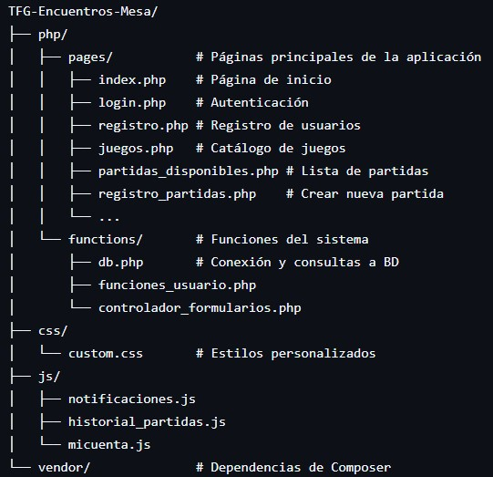 

## ⚙️ Instalación y Configuración

### Prerrequisitos
- PHP 7.4 o superior
- MySQL/MariaDB
- Servidor web (Apache/Nginx)
- Composer

### Pasos de instalación

1. **Clonar el repositorio**
```bash
git clone https://github.com/Adrian-DT/TFG-Encuentros-Mesa.git
cd TFG-Encuentros-Mesa
```

2. **Instalar dependencias**
```bash
composer install
```

3. **Configurar base de datos**
   - Crear una base de datos MySQL llamada `encuentros_mesa`
   - Configurar las credenciales en `php/functions/db.php`

4. **Estructura de la base de datos**
   - `usuarios`: Información de los usuarios registrados
   - `juegos`: Catálogo de juegos de mesa disponibles
   - `partidas`: Partidas programadas
   - `participaciones`: Relación usuarios-partidas
   - `comentario`: Comentarios en las partidas

## 🎮 Funcionalidades Detalladas

### 🏠 Página Principal
La landing page presenta la aplicación con secciones informativas y llamadas a la acción para nuevos usuarios.

### 🎯 Gestión de Juegos
- Visualización del catálogo completo de juegos
- Información detallada: descripción, número de jugadores, duración
- Indicadores de juegos más populares
- Filtrado por categorías

### 🎪 Sistema de Partidas
- **Creación de partidas**: Los usuarios pueden programar nuevas sesiones de juego
- **Participación**: Sistema de inscripción en partidas existentes
- **Gestión temporal**: Diferenciación entre partidas futuras y pasadas
- **Comentarios**: Posibilidad de añadir observaciones a las partidas

### 👤 Perfil de Usuario
- **Historial personal**: Seguimiento de todas las partidas del usuario
- **Partidas pendientes**: Notificaciones de próximas sesiones
- **Gestión de cuenta**: Modificación de datos personales

## 📱 Capturas de Pantalla

### Página Principal
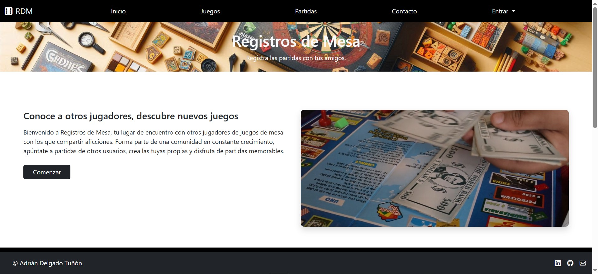
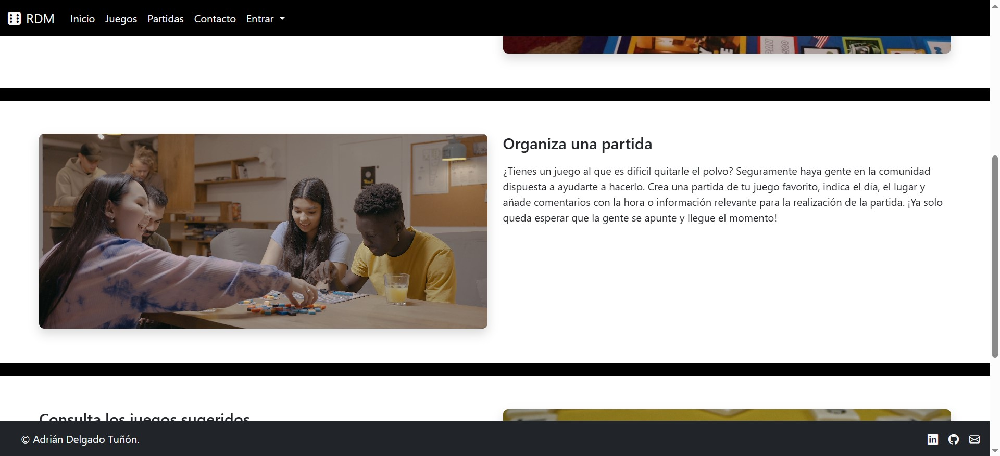
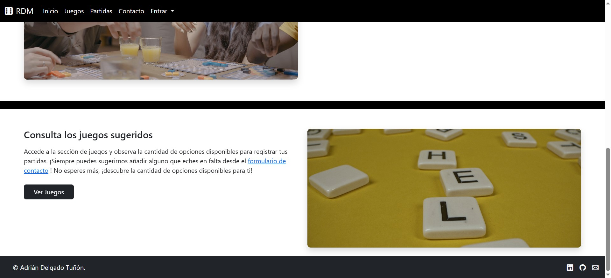

### Catálogo de Juegos
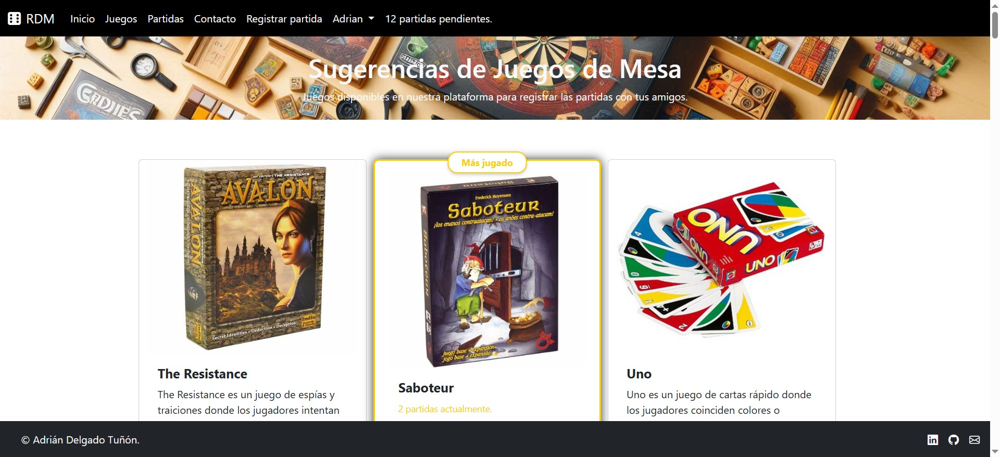
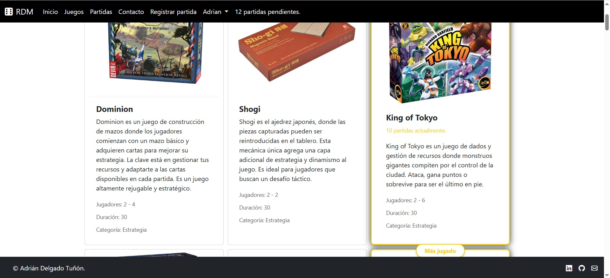

### Lista de Partidas Disponibles
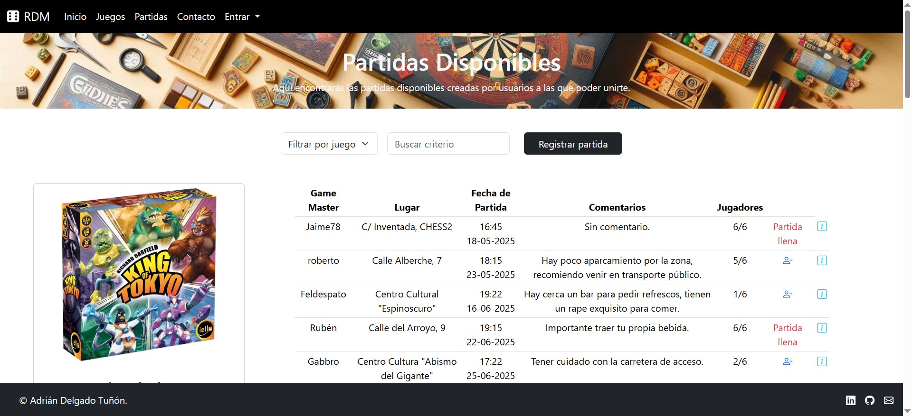
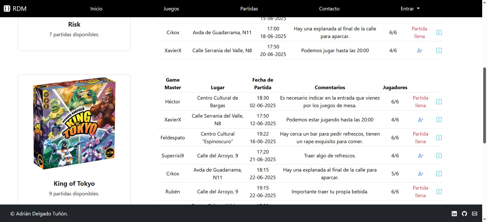

### Panel de Usuario
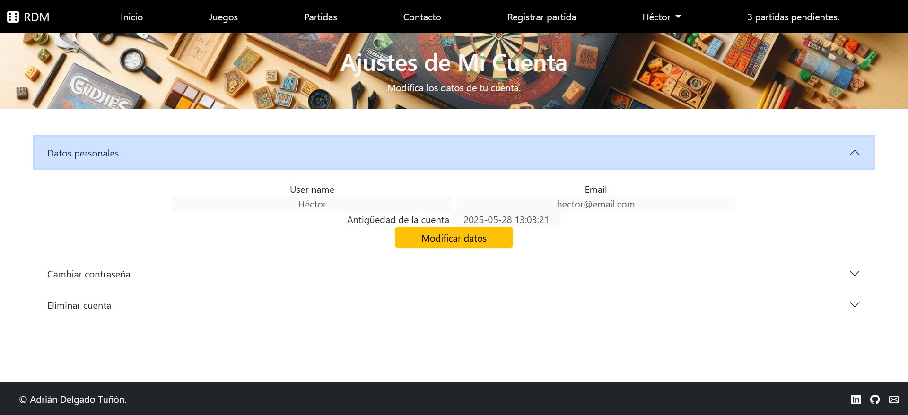
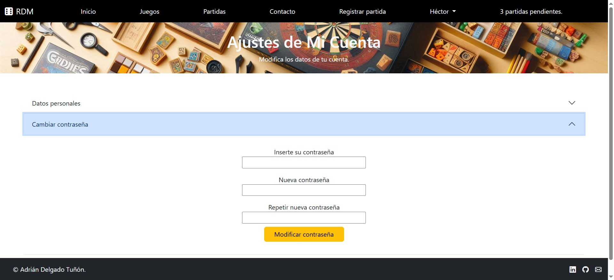
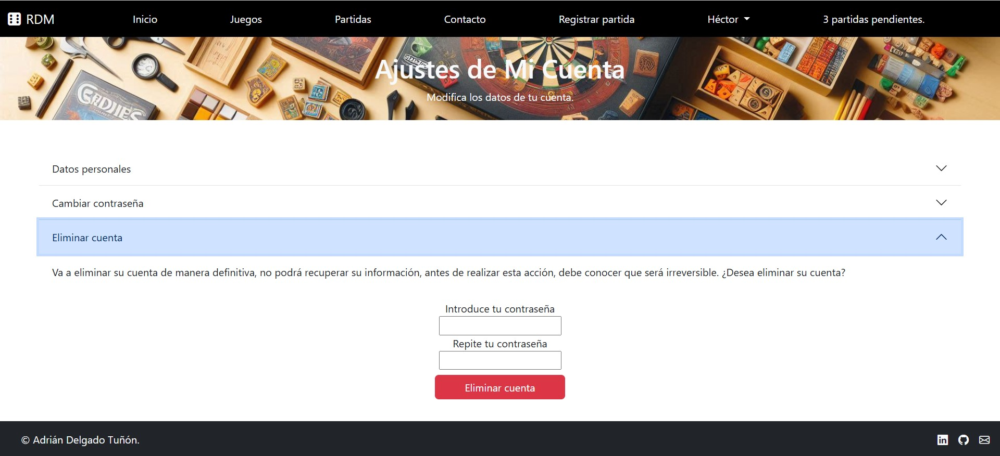

### Formulario de Registro de Partida
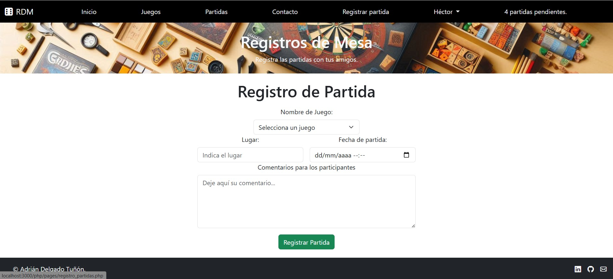

### Historial de partidas
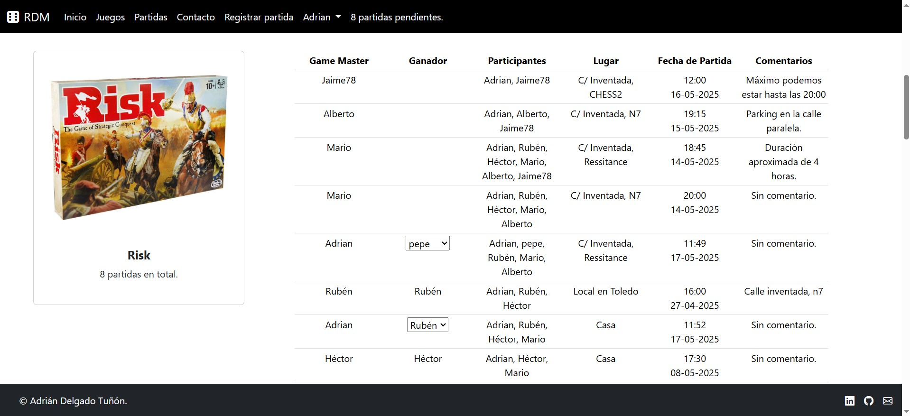
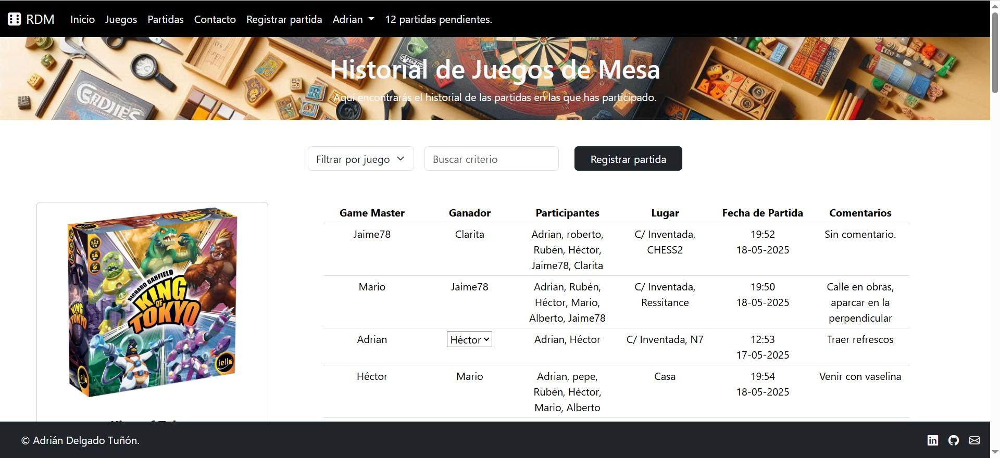


## 🌟 Características Técnicas

### Seguridad
- Autenticación por sesiones PHP
- Consultas preparadas para prevenir inyección SQL
- Validación de formularios tanto en frontend como backend

### Responsive Design
- Interfaz adaptativa usando Bootstrap 5
- Navegación móvil optimizada
- Experiencia de usuario consistente en todos los dispositivos

### Base de Datos
- Diseño relacional optimizado
- Consultas eficientes con JOINs
- Gestión de fechas y contadores automáticos

## 🤝 Contribución

¿Quieres contribuir al proyecto? ¡Genial! Puedes:

1. Reportar bugs o sugerir mejoras a través de Issues
2. Proponer nuevos juegos mediante el formulario de contacto
3. Hacer fork del proyecto y enviar Pull Requests

## 📧 Contacto

- **Email**: adriandt_work@outlook.com
- **LinkedIn**: [adriandt](https://www.linkedin.com/in/adriandt/)
- **GitHub**: [Adrian-DT](https://github.com/Adrian-DT)

## 📄 Licencia

Este proyecto fue desarrollado como Trabajo Final de Grado por Adrián Delgado Tuñón.

## 🏆 Reconocimientos

Proyecto desarrollado como TFG para demostrar competencias en desarrollo web full-stack, incluyendo diseño de bases de datos, programación backend en PHP y frontend responsive.

---

*¿Te gusta jugar a juegos de mesa? ¡Únete a la comunidad RDM y descubre nuevas experiencias de juego!* 🎲

---
